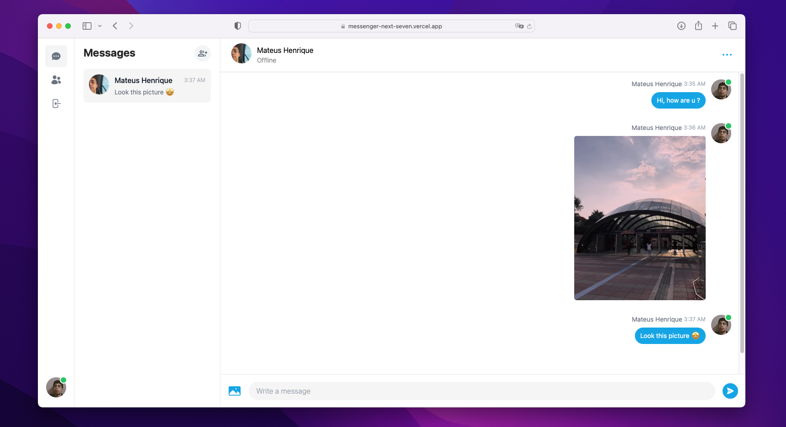

# NextJS Messenger

<p float="center">
  
</p>

## O Projeto

Realtime chat feito em NextJS usando TailwindCSS

## Demo

Você pode testar utilizando esse link: [https://messenger-next-seven.vercel.app/](https://messenger-next-seven.vercel.app/)

## Instalação

1. Clone o repositório: `git clone https://github.com/mateuschaves/messenger-next.git`
2. Instale as dependências: `npm install`
3. Configure as variáveis de ambiente no arquivo `.env` usando o modelo de exemplo em `.env.example`
4. Configure o seu banco de dados usando o seguinte comando: `npx prisma db push`

## Uso

Para iniciar o servidor do expo, utilize o seguinte comando:

```bash
    npm run dev
```


## Contribuição

1. Faça o fork do projeto
2. Crie sua feature branch (`git checkout -b feature/nome-da-feature`)
3. Commit suas mudanças (`git commit -am 'Adicionando nova feature'`)
4. Faça o push para o branch (`git push origin feature/nome-da-feature`)
5. Crie um novo Pull Request

## Licença
MIT
